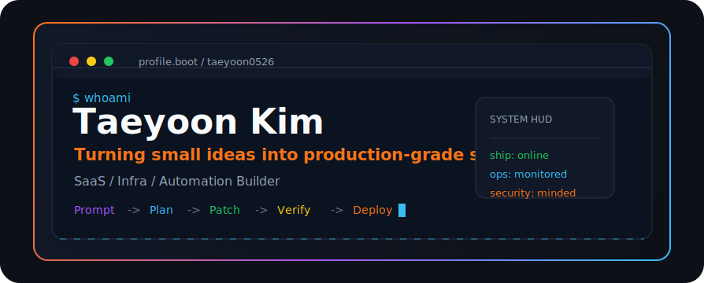
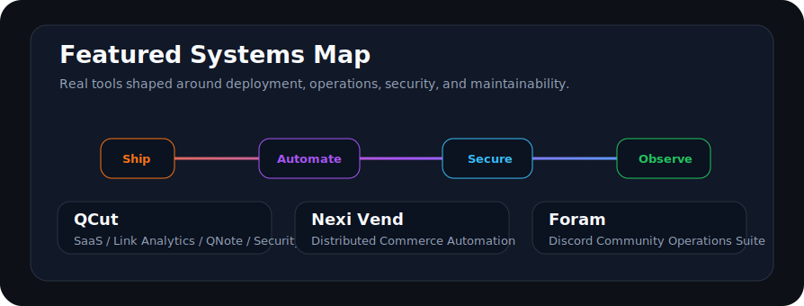
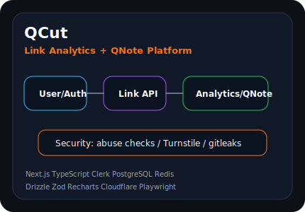
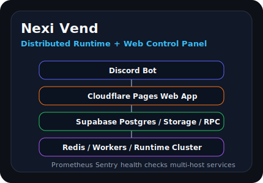
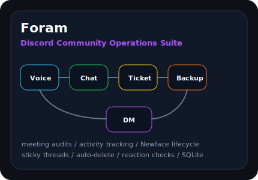
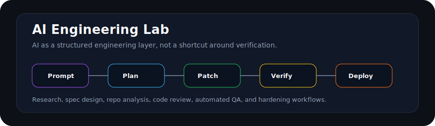
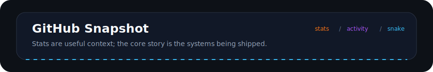
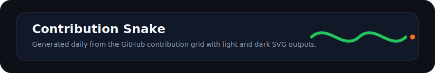

  <picture>
    <source media="(prefers-color-scheme: dark)" srcset="./assets/hero/terminal-hero.svg">
    
  </picture>

  <strong>SaaS / Infra / Automation Builder</strong> 
  Prompt → Plan → Patch → Verify → Deploy 
  작은 아이디어를 실제로 돌아가는 시스템으로 만듭니다.

  <a href="https://github.com/taeyoon0526">GitHub</a>
  ·
  <a href="mailto:me@taeyoon.kr">Email</a>
  ·
  <a href="https://qcut.me">QCut</a>
  ·
  <a href="https://bot.nexiott.shop">Discord Hub</a>
  ·
  <a href="https://discord.com/users/1173942304927645786">Discord</a>
  ·
  <a href="https://t.me/ferox_ty">Telegram</a>

  

## Status HUD

| Signal | Current focus |
| --- | --- |
| Identity | Korean student builder shipping small but real systems |
| Positioning | SaaS, infrastructure, Discord automation, and AI-assisted engineering workflows |
| Operating style | Build the spec, patch the repo, verify the result, deploy with guardrails |
| Public contact | [me@taeyoon.kr](mailto:me@taeyoon.kr) |

## About

I build small but real systems: link platforms, Discord automation, infrastructure workflows, and security-minded tools. The work I like most is practical: a product someone can open, an operations flow that saves time, or a service that keeps running after the first deploy.

I am a Korean student builder exploring real-world SaaS, automation, and infrastructure. I care about clean user flows, clear system boundaries, monitoring, and the small operational details that make a tool usable after launch.

## Featured Projects

Not just demos. These are systems designed around deployment, operations, and maintainability.

  

<table>
  <tr>
    <td width="50%" valign="top">
      
      <h3>QCut — Link Analytics + QNote Platform</h3>
      
<a href="https://qcut.me">qcut.me</a>

      
A production-focused link platform combining short URLs, click analytics, QNote sharing, auth, API workflows, i18n, and security hardening.

      
<strong>Build surface:</strong> Next.js, TypeScript, Tailwind CSS, Clerk, PostgreSQL, Redis, Drizzle, Zod, Recharts, Cloudflare, Caddy, Docker Compose, Turnstile, Sentry, Playwright, Vitest, POEditor, gitleaks.

    </td>
    <td width="50%" valign="top">
      
      <h3>Nexi Vend — Distributed Runtime + Web Control Panel</h3>
      
<a href="https://bot.nexiott.shop">bot.nexiott.shop</a>

      
A Discord-connected digital commerce system with a web control panel, Supabase-backed source of truth, Redis-driven background workers, and runtime monitoring.

      
<strong>Build surface:</strong> Discord Bot, Cloudflare Pages, Supabase, Postgres, Storage, RPC, Redis, Python runtime, multi-host services, Prometheus, Sentry, health checks, workers.

    </td>
  </tr>
  <tr>
    <td width="50%" valign="top">
      
      <h3>Foram — Discord Community Operations Suite</h3>
      
A Discord operations suite for community management, meeting audit logs, voice and chat activity tracking, Newface management, ticket workflows, backups, announcements, and moderation utilities.

      
<strong>Build surface:</strong> discord.py 2.7.1, SQLite, aiosqlite, persistent views, slash commands, server structure backup and restore, photo channel sticky threads, message auto-delete, reaction checks, welcome messages, announcement DM.

    </td>
    <td width="50%" valign="top">
      <h3>Operating Pattern</h3>
      
The shared pattern across these projects is simple: ship a working system, automate the repetitive parts, harden the edges, and observe the runtime.

      <table>
        <tr><td><strong>Ship</strong></td><td>Real services and control panels</td></tr>
        <tr><td><strong>Automate</strong></td><td>Bots, workers, workflows, and background jobs</td></tr>
        <tr><td><strong>Secure</strong></td><td>Auth, validation, abuse checks, secret scanning</td></tr>
        <tr><td><strong>Observe</strong></td><td>Logs, health checks, analytics, regression tests</td></tr>
      </table>
    </td>
  </tr>
</table>

## Discord Ops Lab

Discord is not just a chat surface here. It is an operations environment with admin workflows, persistent UI, audit trails, and automation that has to survive restarts.

| Area | What it demonstrates |
| --- | --- |
| Foram | Community operations, voice and chat tracking, ticket workflows, backups, announcements, moderation utilities |
| Ticket systems | Admin workflows, transcripts, slash commands, persistent views, and support handoff patterns |
| bot.nexiott.shop | A Cloudflare Pages hub for bot landing pages, OAuth callbacks, KV-backed stats, and admin APIs |
| Discord UI Engineering Notes | Component V2 research and implementation notes for discord.py-based interfaces |

## AI Engineering Lab

  

I use AI as a structured engineering layer: research the problem, shape a spec, patch the code, verify the result, and ship with guardrails. Codex and other LLM tools fit into the loop as assistants for repo analysis, planning, implementation, QA, code review, and security hardening.

The goal is not to skip engineering judgment. The goal is to make the loop more explicit: Ideation → Spec → Build → Audit → Deploy.

## Stack Map

| Ship | Automate | Secure | Observe |
| --- | --- | --- | --- |
| Next.js | Python | Clerk | Sentry |
| React | discord.py | Turnstile | Simple Analytics |
| TypeScript | GitHub Actions | Zod | Prometheus |
| Tailwind CSS | Redis | CSP | Playwright |
| PostgreSQL | Workers | gitleaks | Vitest |
| Drizzle | Supabase RPC | secret scanning | BrowserStack |
| Docker Compose | CLI tools | rate limiting | Recharts |
| Caddy / Cloudflare / VPS | tmux / systemd | audit logs | logs / health checks |

## GitHub Snapshot

  

  
  

  

  

  

## Contribution Snake

  

  <picture>
    <source media="(prefers-color-scheme: dark)" srcset="./assets/widgets/github-contribution-grid-snake-dark.svg">
    
  </picture>

## Contact

Explore the projects, check the systems, or reach out if you want to talk about building useful tools.

| Channel | Link |
| --- | --- |
| GitHub | [github.com/taeyoon0526](https://github.com/taeyoon0526) |
| Email | [me@taeyoon.kr](mailto:me@taeyoon.kr) |
| QCut | [qcut.me](https://qcut.me) |
| Discord Hub | [bot.nexiott.shop](https://bot.nexiott.shop) |
| Discord | [discord.com/users/1173942304927645786](https://discord.com/users/1173942304927645786) |
| Telegram | [t.me/ferox_ty](https://t.me/ferox_ty) |

  
Maintenance and validation notes

- Local README assets are checked with `scripts/check-readme-assets.mjs`.
- Secret-like patterns, raw IP addresses, webhook URLs, and private operational details are checked with `scripts/check-readme-secrets.mjs`.
- Contribution snake SVGs are generated by `.github/workflows/snake.yml`.
- WakaTime stats are optional and only update when `WAKATIME_API_KEY` is configured.
- External widgets are useful context, but the README still has local SVG sections if a widget provider is temporarily unavailable.

<!--START_SECTION:waka-->
WakaTime stats are not configured yet. Add `WAKATIME_API_KEY` to enable the optional workflow.
<!--END_SECTION:waka-->

